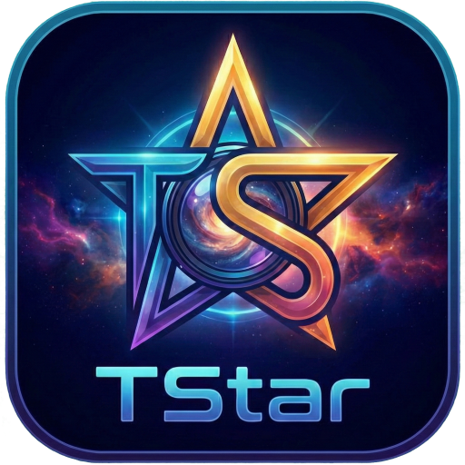

<div align="center">
  
  <h1>TStar</h1>
  <h3>Professional Astrophotography Processing Suite</h3>
</div>

**Author:** Fabio Tempera

**License:** MIT License

**Contributors:**
* [Tim Dicke](https://github.com/dickett): testing of the MacOS versions
* Miroslav Bakoš: testing of the Windows version

## Overview

TStar is a powerful, C++17/Qt6-based image processing platform explicitly designed for astrophotography. It combines high-performance signal processing algorithms with modern AI-based restoration tools to help astrophotographers produce scientific-grade images from their raw data.

## Key Features

*   **Native FITS Support**: Full compatibility with 8, 16, 32-bit integer and floating-point FITS files.
*   **MDI Workspace**: Flexible Multi-Document Interface allowing simultaneous editing of multiple images.
*   **Project Management**: Sidebar with Console logging and FITS Header inspection.
*   **Cross-Platform**: Fully supported on Windows, macOS (Intel & Apple Silicon), with optimized performance.

## Tools & Functionalities

### 1. Stretching & Linear to Non-Linear
Tools to transform raw linear data into viewable images.
*   **Generalized Hyperbolic Stretch (GHS)**: State-of-the-art stretching with independent control over shadows, midtones, and highlights.
*   **Histogram Transformation**: Classic levels adjustment with real-time logarithmic preview.
*   **Curves Transformation**: Precision spline-based contrast / color adjustment.
*   **ArcSinh Stretch**: Color-preserving stretch that boosts saturation while stretching.
*   **Auto Stretch**: One-click screen transfer function for quick visualization.
*   **Star Stretch**: Specialized tool for stretching stars independently (often used with star masks).

### 2. Color Calibration & Correction
*   **Photometric Color Calibration (PCC)**: Solves the image plate and calibrates colors based on Gaia/APASS photometric star catalogs.
*   **PCC Distribution**: Visualizes the color distribution of stars after calibration.
*   **Auto Background Extraction (ABE)**: Models and removes light pollution gradients using polynomial or RBF interpolation.
*   **Background Neutralization**: Removes color casts by aligning background channels.
*   **SCNR (Subtractive Chromatic Noise Reduction)**: Removes generic Green/Magenta color noise.
*   **Saturation**: Adjust color intensity with luminance preservation options.

### 3. AI & Restoration
*   **Cosmic Clarity**: Deep-learning based noise reduction and sharpening.
*   **GraXpert Integration**: Seamless bridge to run GraXpert for AI gradient removal.
*   **StarNet++ Integration**: automated star removal to create starless images for separate processing.
*   **Aberration Remover (RAR)**: Corrects chromatic aberration and star halos.

### 4. Channel Management
*   **Channel Extraction/Combination**: Split RGB into Mono or combine Mono into RGB.
*   **Star Recomposition**: Advanced tool to merge starless and stars images back together with blending modes.
*   **Perfect Palette**: Tool for mapping narrowband data (SHO, HOO, etc.) to artistic color palettes.

### 5. Masking
*   **Mask Generation**: Create masks based on:
    *   Luminance / Chrominance
    *   Star Detection
    *   Specific Color Hues
    *   Linear data
*   **Manual Masking**: Draw masks using polygons or shapes.
*   **Mask Tools**: Invert, Blur, and Overlay visibility controls.

### 6. Utilities & Effects
*   **Plate Solving**: Native astrometric solver to determine image coordinates.
*   **PixelMath**: Powerful expression engine for arithmetic operations between images.
*   **Star Analysis**: Measure FWHM, eccentricity, and other star profile metrics.
*   **Wavescale HDR**: Multiscale High Dynamic Range compression.
*   **FITS Header Editor**: View and modify FITS metadata keywords.
*   **AstroSpike**: Generates artificial diffraction spikes for aesthetic effect.

## Translations
TStar is available in multiple languages:
*   🇬🇧 **English (en)** - Default
*   🇩🇪 **German (de)**
*   🇪🇸 **Spanish (es)**
*   🇫🇷 **French (fr)**
*   🇮🇹 **Italian (it)**

*Translations are located in the `translations/` folder.*

## Installation

### Windows
TStar is distributed as a portable Windows x64 application.
1. Download the latest release.
2. Extract the archive.
3. Run `TStar.exe`.

*Note: Python environments for AI tools (StarNet, etc.) are bundled internally.*

## Building from Source

### Windows
See [BUILDING.md](BUILDING.md) for detailed Windows build instructions using MinGW.

### macOS
See [BUILDING.md](BUILDING.md) for detailed macOS build instructions. Both Intel and Apple Silicon architectures are fully supported.

For quick start:
```bash
chmod +x src/build_macos.sh
./src/build_macos.sh
```

## License
Copyright © 2026 Fabio Tempera.

This project is licensed under the MIT License - see the `LICENSE` file for details.

## Acknowledgments
*   **Qt Framework** for the UI engine.
*   **CFITSIO** for FITS file handling.
*   **OpenCV** for image processing internals.
*   **CCfits** for C++ FITS wrappers.
